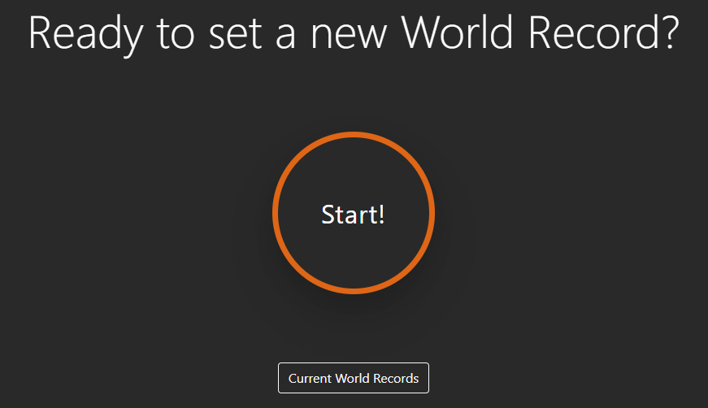

# My Athlete's App

"This repository implements a simple application enabling runners to comapre their running times for the 100 metres running dash with the current world record."

The following files are available: 
* index.html : HTML file sets the format
* input.js : Javascript file contains the functionality of comparing the running time inputs and generating the custom alert boxes
* style.css: Styling and Animation of the page - customised animated buttons and alert boxes have been integrated for a more fun experience

To test the application simply open the index.html file in any browser.

